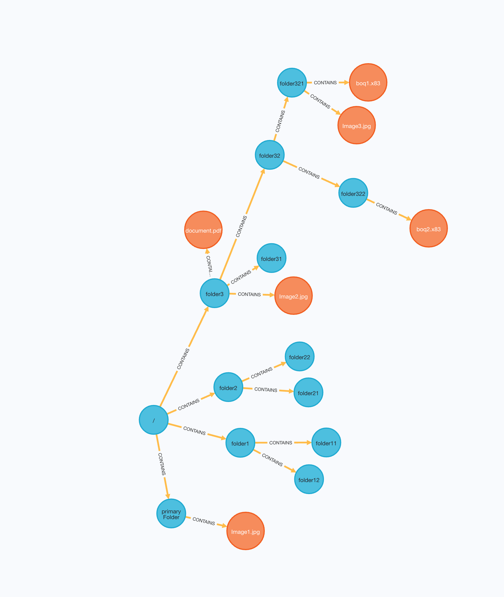

# Neo4J File Manager POC

this small project is to demo the capabilities of NEO4J in shaping the File Manager.

Documentation about Neo4J can be found [here](https://neo4j.com/docs/)

## Rationale

Neo4J allows us to shape a File structure in a more intituive way and to navigate through it in a more efficient and faster fashion.

After creating the structure as described below (Test), you can see the following in the browser:



## Setup

### Run Neo4J

Run the databse in a docker container:

```
docker run --name test --publish=7474:7474 --publish=7687:7687 --env=NEO4JLABS_PLUGINS='["apoc"]' --env=NEO4J_AUTH=none neo4j:latest
```

this run a Neo4J instance without credentials.

You can check the content of the database using the browser interface here [http://localhost:7474/browser/](http://localhost:7474/browser/)

Run query `MATCH (n) return n` to see the contents of the database.

### Run the Service

Run the service in intellij. No Extra configuration needed

### Test

To test, use the Postman collection [here](postman/Neo4J File Manager.postman_collection.json)

To set up Postman variables, run all the request in folder Setup and Create

## Operation allowed

### Upload Files

```
curl --location --request POST 'http://localhost:8080/api/file' \
--form 'file=@"/Users/massi/Desktop/test_files/Image1.jpg"' \
--form 'folderId="cc82fdc7-ddd0-471b-adaa-488d3ee026ba"'
```

### Get File info

```
curl --location --request GET 'http://localhost:8080/api/file/a7a938a2-7eed-42c9-8d6a-088740b9cf31'
```

### Update File info

* Rename
```
curl --location --request PUT 'http://localhost:8080/api/file/a7a938a2-7eed-42c9-8d6a-088740b9cf31' \
--header 'Content-Type: application/json' \
--data-raw '{
    "name": "new_Image1.jpg"
}'
```

* Move

```
curl --location --request PUT 'http://localhost:8080/api/file/de5b428d-f6c8-4a2b-b28c-1c21d5443bf4' \
--header 'Content-Type: application/json' \
--data-raw '{
    "folder": "a976803f-1227-4a10-ab75-cd941bf4203e"
}'
```

### Delete File

```
curl --location --request DELETE 'http://localhost:8080/api/file/a7a938a2-7eed-42c9-8d6a-088740b9cf31'
```

### Create Folder

```
curl --location --request POST 'http://localhost:8080/api/folder' \
--header 'Content-Type: application/json' \
--data-raw '{
    "folder": "0f1a3bb7-6e47-4edb-96c0-51cce1b1774a",
    "name": "bluetooth Folder"
}'
```

### Get Folder info

```
curl --location --request GET 'http://localhost:8080/api/folder/cc82fdc7-ddd0-471b-adaa-488d3ee026ba'
```

### Get Folder files

```
curl --location --request GET 'http://localhost:8080/api/folder/a976803f-1227-4a10-ab75-cd941bf4203e/files'
```

### Search files and folders

* Search by path

```
curl --location --request GET 'http://localhost:8080/api/folder/0f1a3bb7-6e47-4edb-96c0-51cce1b1774a/files?path=/folder3'
```

* Search by name

```
curl --location --request GET 'http://localhost:8080/api/folder/0f1a3bb7-6e47-4edb-96c0-51cce1b1774a/files?q=boq'
```

### Update Folder info

* Rename 

```
curl --location --request PUT 'http://localhost:8080/api/folder/e014fd15-2a7b-4bb4-9f73-b197aa469a15' \
--header 'Content-Type: application/json' \
--data-raw '{
    "name": "folder11B"
}'
```

* Move

```
curl --location --request PUT 'http://localhost:8080/api/folder/cb8dc356-9921-4b93-84f3-2878cfaf4b1a' \
--header 'Content-Type: application/json' \
--data-raw '{
    "folder": "a976803f-1227-4a10-ab75-cd941bf4203e"
}'
```

### Delete Folder

```
curl --location --request DELETE 'http://localhost:8080/api/folder/cc82fdc7-ddd0-471b-adaa-488d3ee026ba'
```

List of allowed operation are in the Postman collection [here](postman/File Manager API.postman_collection.json)

## Extra 

a custom annotation `HasAccessToFile` `HasAccessToFolder` has been created (in Java) to check for user's permission to access specific resources.